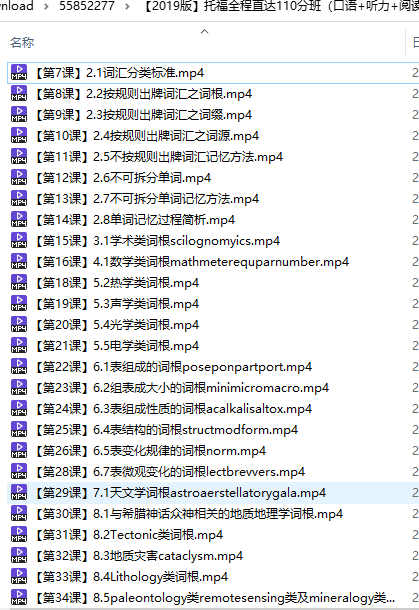

# bilibili UWP 下载视频重命名工具（Python）

 - 在 Win10商店中下载【哔哩哔哩动画】

 - 登录后找到视频，点击下载，如图：
   

 - 格式选`MP4`,**勾选自动合并** （迫于C盘空间不足，截图选了最低码率，自己下载可以选高一点的）
 

 - 等待下载完成，目录结构如下图
    

 - 分析一下文件结构，看到 `.dvi` 文件、分p目录下的`.info`文件，打开看看，其实就是个`json` 文件，包含视频系列的标题、描述等信息
    

    
   思路有了：
        1、读取`.dvi` 文件，拿到视频系列标题
        2、读取`.info`文件,为分p的mp4改名
        3、整合进新的文件夹
   刚好在学习python，
  ## 用法：
 
   打开`init.py`, 修改成你的下载路径, 然后运行即可(python3)（刚开始学py，代码很烂，大佬勿喷）
   

   
  对于分P很多的视频，用代码重命名还是很方便的~ 接下来就可以用自己喜欢的离线播放器观看了~ 

## 注意事项
   
   - 目录记得写成截图上那样，有双斜杠
   - 注意C盘的可用空间，哔哩哔哩客户端默认下载目录在C盘

## reference
https://www.bilibili.com/read/cv1422476/